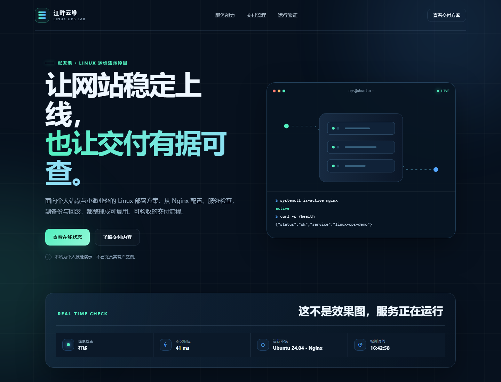

# Linux Ops Demo

一个面向首单展示的 Linux + Nginx 运维交付项目。它不是虚构的客户案例，而是一套可复现、可检测、可备份、可回滚的个人技能演示。



## 已实现

- 响应式静态展示站，无外部 CDN 依赖。
- Nginx 独立站点配置，监听 `8088`。
- `/health` JSON 健康检查接口。
- CSP、禁止嵌入、类型嗅探防护等常用安全响应头。
- 基于 release 目录和 `current` 软链接的原子发布。
- 自动保留最近 5 个版本。
- 健康检查、备份和回滚脚本。

## 项目结构

```text
linux-ops-demo/
├── public/                 # 网站文件
│   ├── index.html
│   └── assets/
├── nginx/                  # Nginx 站点配置
├── scripts/                # 部署、检测、备份、回滚
├── docs/                   # 交付清单、演示话术与验收截图
├── .gitattributes          # 保证 Linux 脚本使用 LF 换行
└── README.md
```

## 首次部署

在 Ubuntu 中执行：

```bash
cd ~/projects/linux-ops-demo
sudo bash scripts/deploy.sh
```

部署完成后访问：<http://localhost:8088>

## 日常操作

```bash
# 验收服务（无需 sudo）
bash scripts/health-check.sh

# 备份到 D:\Codex\backups\linux-ops-demo
bash scripts/backup.sh

# 回滚到上一个发布版本
sudo bash scripts/rollback.sh
```

## 关键路径

- Windows 项目目录：`D:\Codex\projects\linux-ops-demo`
- Ubuntu 项目目录：`~/projects/linux-ops-demo`
- 部署目录：`/srv/linux-ops-demo`
- 访问日志：`/var/log/nginx/linux-ops-demo.access.log`
- 错误日志：`/var/log/nginx/linux-ops-demo.error.log`
- 备份目录：`D:\Codex\backups\linux-ops-demo`

## 安全说明

- 仓库不保存服务器密码、私钥或客户数据。
- SSH 服务默认不因本项目而开放。
- 生产环境操作前必须确认授权、备份和回滚窗口。
- HTTPS 需要真实域名后再配置，不在本地演示中伪造证书。
